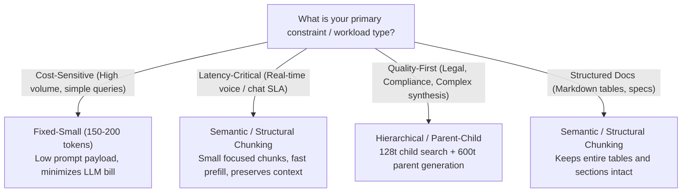

# Chunking Strategies: Quality, Latency, and Cost Trade-Offs

In enterprise RAG systems built on AWS Bedrock, chunking is not simply an arbitrary text-splitting routine—it is the foundational architectural decision governing the **Quality-Latency-Cost Trilemma**:

```
                         [QUALITY]
                 (Precision, Completeness, Faithfulness)
                           /   \
                          /     \
                         /       \
                        /  RAG    \
                       / TRILEMMA  \
                      /             \
            [LATENCY] --------------- [COST]
        (Embedding, TTFT,           (Embeddings, Vector DB Storage,
         LLM Prefill Time)           LLM Prompt Input Tokens)
```

> **Presentation References:**
> - Slide 20 (*Chunking & Retrieval Trade-Offs*) - *Building Agentic Workflows with RAG on AWS Bedrock*
> - Slide 21 (*Balancing Quality, Latency, and Cost in RAG*) - *Hands-On RAG with AWS*
> - Slide 19 (*Layout-Aware Chunking & Multimodal Parsing*) - *Hands-On RAG with AWS*

---

## 1. The Trilemma Dimensions Explained

| Dimension | Key Metrics | Why Chunking Directly Influences It |
|---|---|---|
| **Quality** | Retrieval Precision@k, Context Completeness, Table Integrity, Answer Faithfulness | Slicing too small fragments sentences and severs tables from their headers. Slicing too large introduces semantic noise and causes the LLM to miss key details ("lost in the middle"). |
| **Latency** | Ingestion Embedding Latency, Vector Search Time, LLM Prefill / Time-To-First-Token (TTFT) | LLM prefill latency scales linearly with input prompt token size. Supplying 5 chunks of 1000 tokens adds ~100-150ms of prompt processing latency compared to 5 chunks of 150 tokens. |
| **Cost** | Embedding Token Costs, Vector DB Storage Footprint, LLM Input Token Billing | LLM input prompt tokens represent **85-95%** of recurring operational expenses. A strategy that feeds 1,000 prompt tokens vs 300 prompt tokens per query increases ongoing monthly LLM bills by **3x**. |

---

## 2. Strategies Evaluated

1. **Fixed-Small (150 tokens, 25 overlap)**:
   - *Strengths*: Minimal LLM prompt input cost ($309 / 100k queries) and ultra-fast prefill (~51ms).
   - *Weaknesses*: Low answer completeness (40%) on multi-step workflows; severs markdown tables from column headers.
2. **Fixed-Medium (400 tokens, 50 overlap)**:
   - *Strengths*: Standard Bedrock Knowledge Bases default compromise; solid completeness (80%).
   - *Weaknesses*: Moderate prompt bloat ($447 / 100k queries, +46% cost).
3. **Fixed-Large (1000 tokens, 100 overlap)**:
   - *Strengths*: High context capture (100% completeness on broad questions).
   - *Weaknesses*: Precision drops to 50% due to context dilution; highest prefill latency and elevated inference bills ($468 / 100k queries).
4. **Hierarchical / Parent-Child (Child 150t $\rightarrow$ Parent 600t)**:
   - *Strengths*: Best-of-both-worlds quality: 100% precision in vector space + 100% completeness in LLM context.
   - *Weaknesses*: High prompt payload sent to LLM ($503 / 100k queries).
5. **Semantic / Structural (Markdown & Table Preservation)**:
   - *Strengths*: Preserves logical units, sections, and whole tables without cutting rows in half. Pareto-optimal balance across cost ($306 / 100k queries) and latency (300ms total).

---

## 3. Empirical Benchmark Summary

Running `python chunking_benchmark_suite.py`:

```
=========================================================================================================
 AWS BEDROCK RAG CHUNKING STRATEGY BENCHMARK: QUALITY vs. LATENCY vs. COST
=========================================================================================================

[1] QUALITY BENCHMARK (Precision, Answer Completeness & Structural Integrity)
---------------------------------------------------------------------------------------------------------
Strategy                       | Chunks  | Avg Tokens | Precision  | Completeness  | Table Intact
---------------------------------------------------------------------------------------------------------
Fixed-Small (150t)             | 7       | 136        |     70.0% |        40.0% |         86%
Fixed-Medium (400t)            | 3       | 303        |    100.0% |        80.0% |        100%
Fixed-Large (1000t)            | 1       | 812        |     50.0% |       100.0% |        100%
Hierarchical (Parent-Child)    | 7       | 139        |    100.0% |       100.0% |         86%
Semantic (Structural)          | 7       | 115        |     90.0% |        80.0% |        100%

[2] LATENCY BENCHMARK (Ingestion, Retrieval & LLM Prefill Latency)
---------------------------------------------------------------------------------------------------------
Strategy                       | Ingest (ms) | Retrieve (ms) | Prefill (ms) | Total Latency 
---------------------------------------------------------------------------------------------------------
Fixed-Small (150t)             |        0.13 |          0.01 |        51.60 |       301.61 ms
Fixed-Medium (400t)            |        0.09 |          0.01 |       107.04 |       357.05 ms
Fixed-Large (1000t)            |        0.07 |          0.00 |       115.44 |       365.44 ms
Hierarchical (Parent-Child)    |        0.10 |          0.01 |       129.36 |       379.37 ms
Semantic (Structural)          |        0.09 |          0.01 |        50.52 |       300.53 ms

[3] COST BENCHMARK (Embedding, Vector Storage & LLM Inference @ 1,000 queries)
---------------------------------------------------------------------------------------------------------
Strategy                       | Prompt Tokens | Embed ($/1k docs) | LLM Cost ($/1k Q)  | Monthly @ 100k Q
---------------------------------------------------------------------------------------------------------
Fixed-Small (150t)             |           280 | $         0.0191 | $          3.0900 | $        309.00
Fixed-Medium (400t)            |           742 | $         0.0182 | $          4.4760 | $        447.60
Fixed-Large (1000t)            |           812 | $         0.0162 | $          4.6860 | $        468.60
Hierarchical (Parent-Child)    |           928 | $         0.0196 | $          5.0340 | $        503.40
Semantic (Structural)          |           271 | $         0.0162 | $          3.0630 | $        306.30

[4] THE BALANCING ACT: PERSONA DECISION MATRIX (Scale 0 - 100)
---------------------------------------------------------------------------------------------------------
Strategy                       | Cost-Sensitive | Latency-Critical | Quality-First  | Balanced Score
---------------------------------------------------------------------------------------------------------
Fixed-Small (150t)             |           55.5 |             73.5 |           61.5 |           63.7
Fixed-Medium (400t)            |           50.1 |             77.7 |           74.0 |           63.5
Fixed-Large (1000t)            |           48.2 |             75.5 |           70.7 |           61.4
Hierarchical (Parent-Child)    |           51.6 |             79.0 |           77.7 |           65.1
Semantic (Structural)          |           64.5 |             83.7 |           78.9 |           73.7
---------------------------------------------------------------------------------------------------------
```

---

## 4. How to Balance Between the Three: Decision Framework



---

## 5. Quickstart

### Run CLI Benchmark Suite
```bash
# Run benchmark in simulation/mock mode
python chunking_benchmark_suite.py --mock

# Output raw JSON metrics
python chunking_benchmark_suite.py --json
```

### Interactive Notebook
Open and run `chunking_tradeoffs_demo.ipynb` to visualize severed chunks, test query responses, and interact with the custom persona balance calculator.
